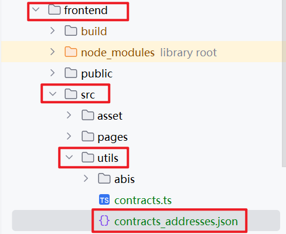
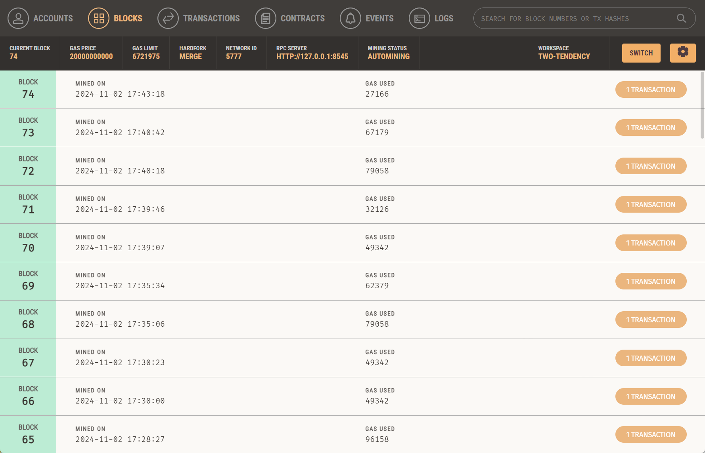
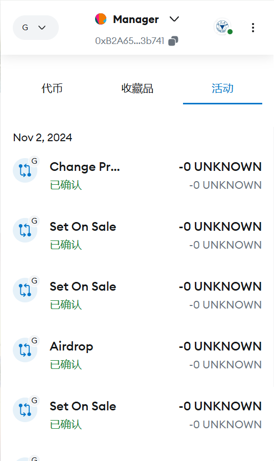

# 2024_blockchain_hw2

作业提交方式为：**提交视频文件**和**仓库的链接**到指定邮箱。

## 如何运行

1. 在本地启动ganache应用。


2. 将端口改为8545


3. 复制前三个账户的私钥到`contracts/hardhat.config.ts`的`accounts`中。


4. 在 `./contracts` 中安装需要的依赖，运行如下的命令：
    ```bash
    npm install
    ```
5. 在 `./contracts` 中编译并部署合约，运行以下命令：
    ```bash
    npx hardhat run ./scripts/deploy.ts --network ganache
    ```
6. 将部署合约的地址对应填入 `./frontend/src/utils` 中的 `contracts_addresses.json`。

7. 将`contracts/artifacts/contracts/BuyMyRoom.sol/BuyMyRoom.json`和`contracts/artifacts/contracts/MyERC20.sol/MyERC20.json`复制到`frontend/src/utils/abis`目录下。

8. 在 `./frontend` 中安装需要的依赖，运行如下的命令：
    ```bash
    npm install
    ```
9. 在 `./frontend/README.md` 中启动前端程序：

10. 在谷歌浏览器中打开 `http://localhost:3000/` 即可看到前端页面。


## 功能实现分析

简单描述：项目完成了要求的哪些功能？每个功能具体是如何实现的？

建议分点列出。

- 功能1：实现了ERC20代币的发行和转账功能。
  - 实现：在`MyERC20.sol`中实现了ERC20代币的发行和转账功能。
- 功能2：实现了ERC20代币空投
  - 实现：在`MyERC20.sol`中实现了ERC20代币空投功能。并通过前端页面中的空投按钮实现了空投功能。
- 功能3：实现了我的房产展示功能
  - 用户可在页面中看到用户的个人房产以及信息。
- 功能4：实现了用ERC20代币购买房产功能
  - 用户可在展示出的在售房产中选择购买，并通过ERC20代币进行支付。
- 功能5：实现了个人房产出售功能
  - 用户可在页面中选择自己的房产进行出售，并设置价格。
- 功能6：实现了对于已挂牌的房产的价格修改功能
  - 用户可在页面中选择自己的已挂牌房产进行价格修改。
- 功能7：实现了查看挂牌房产功能
  - 用户可在页面中查看所有已挂牌房产。

## 项目运行截图

- 进入前端后，点击连接钱包连接到Metamark钱包。
  
- 选择或导入本地Ganache的三个账户私钥（与前面一致）

- 连接成功后，即可看到管理员地址和当前用户地址，如果当前不是管理员账户，则点击小狐狸切换账户至管理员。

- 点击`领取浙大币空投`，确认交易后即可获得 10000 ERC20代币。

- 任选一个房产进行出售，输入价格后点击`出售`按钮，确认交易后即可挂牌出售。

- 滚动页面至下方，可以查看在售房产，拥有者不可以购买自己的房产。

- 点击小狐狸切换至第二个账户，即可看到第二个账户的房产信息，以及购买在售房产。

- 领取浙大币空投后，可以选择购买房产，点击`购买`按钮，确认交易后即可购买房产。

- 在我的房产中，可以看到用户刚刚购入的房产，以及上方余额的变化（切换回第一个账户，可以看到账户余额的增加）


- 切换至第二个账户，挂牌出售刚刚购入的房产，再切换至第三个账户进行购买，可以看到平台（管理员）收取挂牌手续费的效果。


这里可以看到第二个账户收款只收了991，管理员收取了9的手续费。
- 在`我的房产`中，在售房产可以进行价格修改，输入新价格并确认后，可以在`在售房产`中看到价格的变化。


- 与本地Ganache交互截图


- 与小狐狸交互截图


## 参考内容

- 课程的参考Demo见：[DEMOs](https://github.com/LBruyne/blockchain-course-demos)。

- 快速实现 ERC721 和 ERC20：[模版](https://wizard.openzeppelin.com/#erc20)。记得安装相关依赖 ``"@openzeppelin/contracts": "^5.0.0"``。

- 如何实现ETH和ERC20的兑换？ [参考讲解](https://www.wtf.academy/en/docs/solidity-103/DEX/)

如果有其它参考的内容，也请在这里陈列。
